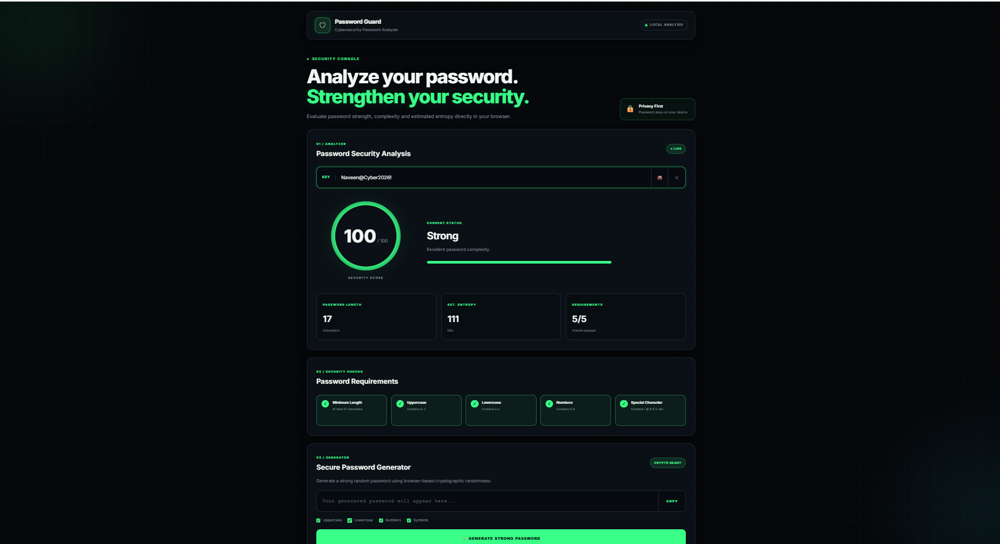

# 🔐 Password Guard

A modern cybersecurity-focused password strength analyzer and secure password generator built with HTML, CSS, and JavaScript.


## 🚀 Features

- Password strength analysis
- Security score from 0–100
- Password entropy estimation
- Real-time security requirements
- Uppercase, lowercase, number and symbol detection
- Show/Hide password
- Clear password
- Secure password generator
- Cryptographically secure random generation
- Copy generated password
- Responsive design for desktop, tablet and mobile
- Client-side password analysis

## 🛡️ Privacy

Password analysis is performed locally in the browser. The application does not intentionally send the entered password to a server.

## 🛠️ Technologies Used

- HTML5
- CSS3
- JavaScript
- Web Crypto API

## 📱 Responsive Design

Password Guard is designed to work across:

- Desktop
- Laptop
- Tablet
- Mobile devices

## 📂 Project Structure

```text
Password-Guard-Cyber-Dashboard/
│
├── index.html
├── style.css
├── script.js
├── README.md
└── .gitignore
